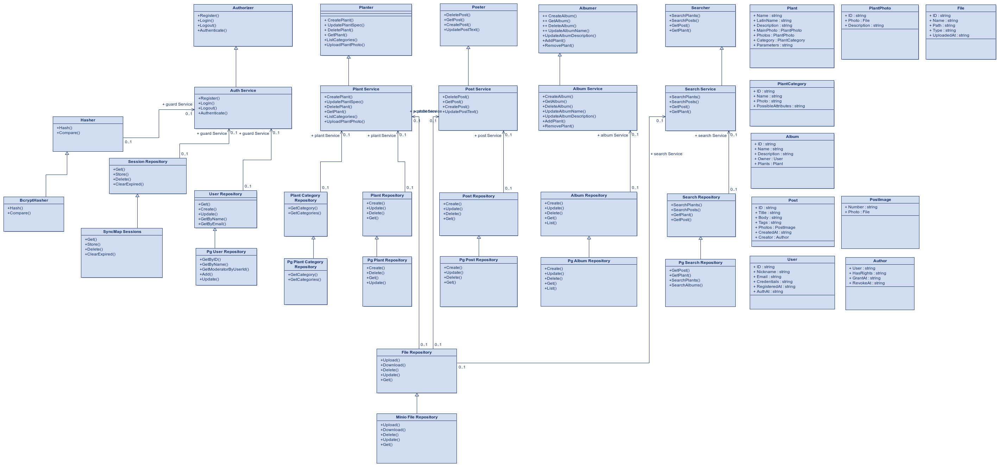

# Сайт-блог ландшафтного архитектора со справочником растений

**Идея проекта:** Личный сайт-блог с возможностью написания постов про растения и справочником растений и галерей экспозиций различных растений. В справочнике есть возможность поиска растений по биологическим и визуальным характеристкам растений. Посты формируются текстом и произвольным количеством изображений, помечаются тегами, по которым их можно искать. У пользователей есть возможность формировать альбомы, содержащие растения, для объединения их по общим признакам, применениям и т.д.

**Предметная область:** Ландшафтная архитектура, в частности растения используемые в ней, обладающие большим количеством характеристик.

## Сравнение с другими проектами

| Проекты                | Поиск растений по критериям | Создание альбомов | Посты про растения |
|------------------------|-----------------------------|-------------------|--------------------|
| plantsfinder.ru        | +                           | -                 | +                  |
| ideas.by               | -                           | -                 | +                  |
| catalog.greenmaster.by | +                           | -                 | -                  |
| **Данный проект**      | **+**                       | **+**             | **+**              |

Актуальность проекта заключается в том, что многим начинающим ландшафтным архитекторам не хватает опыта и знаний для выбора растений в условиях различной освещённости зон, морозов и других параметров, а также примеров реализации сочентаний различных растений, из-за чего приходится долго искать подходящие по визуальным и биологическим параметрам сочетания растений.

## Роли(акторы)

 - **Неавторизованный пользователь** - пользователь не прошедший регистрацию и/или авторизацию
 - **Авторизованный пользователь** - зарегистрированный пользователь, способен создавать альбомы и добавлять в них  растения
 - **Автор** - пользователь, способный добавлять новые посты и растения
 - **Администратор** - пользователь, способный менять структуру характеристик растений

## ER-модель

## BPMN 

# Реализиция

**Тип приложения:** MPA

**Технологический стек:**
 - Язык программирования: **Go**
 - Http-handlers: **Gin**
 - Html-renderer: **Templ**
 - Postgres-driver: **Pgx** + **Squirrel**
 - База данных: **Postgresql**
 - Объектное хранилище: **Minio**
 - Unit-тестирование: **Go-test, Testify**

## Диаграмма компонентов

## Диаграмма классов

## Комментарий

6-я лабораторная получилась частью 5-ой (сразу писал с докером, конфигами, логгами и т.д.)